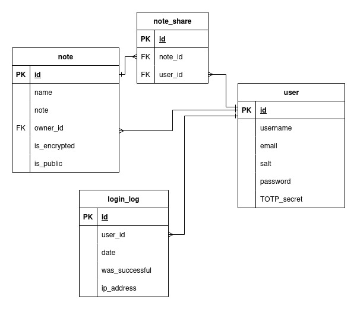

# OD - Projekt 2023Z

Projekt zaliczeniowy przedmiotu *Ochrona danych w systemach informatycznych*.

## Opis

Bezpieczna aplikacja internetowa pozwalająca na przechowywanie i udostępnianie notatek tekstowych. Niekóre notatki mogą być szyfrowane.

## Uruchomienie aplikacji
```
docker-compose up --build
```
Uruchomiona aplikacja działa pod adresem http://0.0.0.0:8000

Wyłączenie aplikacji:
```
docker-compose down
```

## Aplikacja umożliwia:
- szyfrowanie i odszyfrowywanie notatek na podane hasło
- udostępnianie notatek wybranym użytkownikom (tylko niezaszyfrowane)
- udostępnianie notatek publicznie (tylko niezaszyfrowane)
- w notatkach można używać styli (np. pogrubienie, pochylenie, nagłówki, dodanie zdjęcia itd.)
- rejestracja użytkowników
- logowanie z użyciem uwierzytelnienia dwuskładnikowego (TOTP)
- bezpieczne przechowywanie haseł (funkcje mieszające, sól, wielokrotne haszowanie)
- kontrola siły (entropi) hasła 
- opóźnienia przy logowaniu
- wszystkie dane wejściowe użytkownika podlegają walidacji

## czego (jeszcze) nie ma:
- weryfikacja liczby nieudanych prób logowania
- szyfrowane połączenie z aplikacją

## Użyte technologie
Aplikacja została napisana w języku python przy użyciu frameworku Flask. Wykorzystuje następujące pakiety:
- flask
- flask_login
- flask_sqlalchemy
- flask_wtf
- flask_bcrypt
- pyotp
- pycryptodome
- markdown

Aplikajca korzysta z serwera WSGI *Gunicorn* oraz z *Nginx* jako serwer reverse proxy. Całość jest skonteneryzowana przy użyciu *Dockera*.

Aplikacja posiada bazę danych SQLite. Schemat bazy danych:



